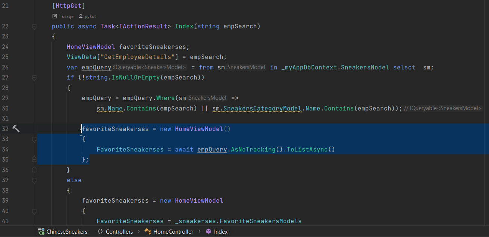
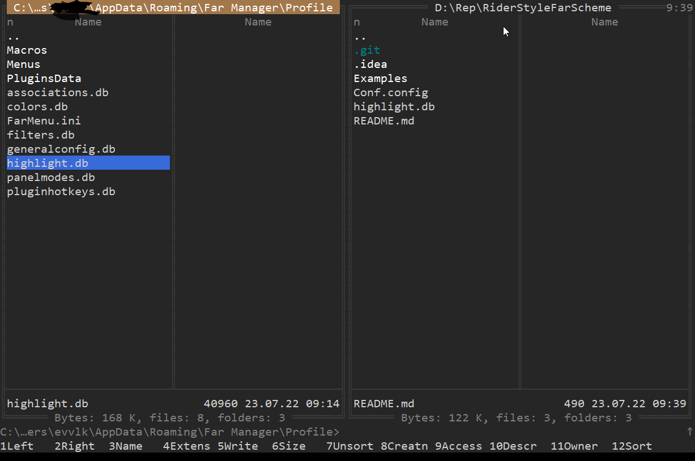

## Install

For install run command: ```far /import Conf.config```

Next go to main menu Far manager (`F9`) > `Options` > `Interface settings`.

And check the box near `Use Virtual Terminal for Rendering`.

Save new configuration (`Shift+F9`).

Save your original highlight file - `highlight.db` and 
replace with a new one from this project.
Your `highlight.db` is probably located in the directory:
`%AppData%\Far Manager\Profile`.

Close Far Manager.

To install new font select `JetBrainsMono-Regular.ttf`, right-click any of them, then pick “Install” from the menu.

Run Far Manager as Administrator. Right-click on the window title, select Properties.
Switch to font tab select `JetBrainsMono`.

Enjoy.

## Examples


